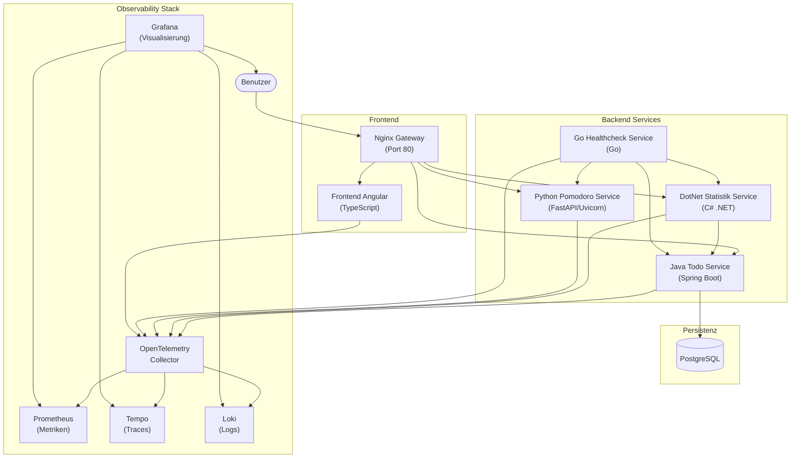
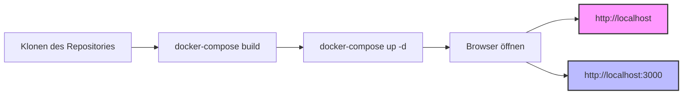
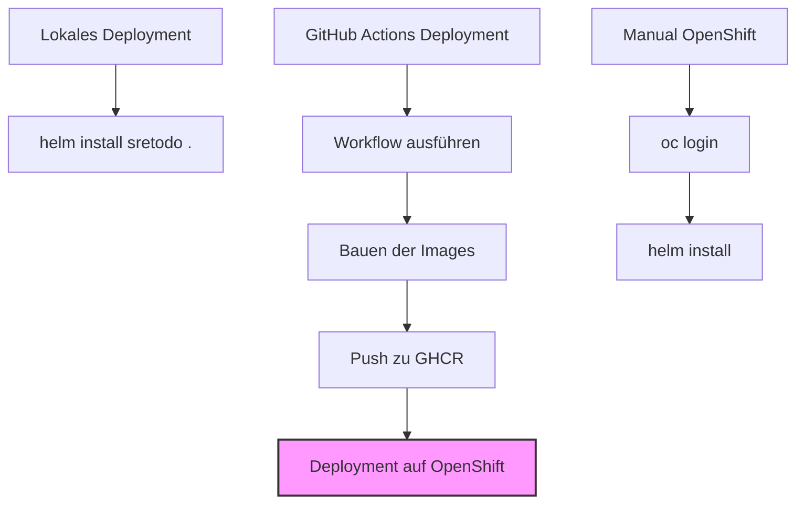

# SRE ToDo - Observability MVP Demo App

Dieses Projekt dient als Demo-Anwendung zur Veranschaulichung eines einfachen Observability Stacks für eine Microservice-Architektur.

## Ziel

Ziel ist es, eine Anwendung mit mehreren Microservices (Java, .NET, Python, Go, Angular Frontend) bereitzustellen und deren Telemetriedaten (Metriken, Logs, Traces) mit OpenTelemetry zu sammeln und in einem zentralen Stack (Prometheus, Loki, Tempo, Grafana) zu visualisieren.

## Architektur



- **Microservices:**
  - `frontend-angular`: Angular Web UI
  - `service-java-todo`: Java (Spring Boot) Service für ToDo-Management
  - `service-dotnet-statistik`: .NET Service für Statistik-Aggregation
  - `service-python-pomodoro`: Python (FastAPI/Uvicorn) Service für Pomodoro-Timer
  - `service-go-healthcheck`: Go Service zur Überwachung der anderen Services
- **Observability Stack (via Docker Compose):**
  - `otel-collector`: OpenTelemetry Collector (Contrib) zum Empfangen und Verarbeiten von Telemetriedaten.
  - `prometheus`: Speicherung und Abfrage von Metriken.
  - `loki`: Speicherung und Abfrage von Logs.
  - `tempo`: Speicherung und Abfrage von Traces.
  - `grafana`: Visualisierung der Daten aus Prometheus, Loki und Tempo.
- **Datenbank (via Docker Compose):**
  - `postgresql`: PostgreSQL Datenbank zur Persistenz der ToDo-Daten.
- **API Gateway:**
  - `nginx`: Nginx als zentraler Einstiegspunkt, der Anfragen an die entsprechenden Services weiterleitet.

## Observability Stack Details

| Komponente       | Image                                          | Version | Konfiguration                                               |
| ---------------- | ---------------------------------------------- | ------- | ----------------------------------------------------------- |
| Grafana          | `grafana/grafana`                              | `11.1.0`  | `docker-compose.yml` (env vars), Provisioning (`datasources.yaml`) |
| Tempo            | `grafana/tempo`                              | `2.7.1`   | `observability-stack/tempo-config.yaml`                     |
| Prometheus       | `prom/prometheus`                            | `v3.2.1`  | `observability-stack/prometheus.yml`                        |
| Loki             | `grafana/loki`                               | `3.4.2`   | `docker-compose.yml` (command line args)                    |
| OTEL Collector   | `otel/opentelemetry-collector-contrib`         | `0.123.0` | `observability-stack/otel-collector-config.yaml`            |

- **Grafana Datenquellen:** Werden über Provisioning in `observability-stack/grafana/provisioning/datasources/datasources.yaml` konfiguriert.
- **Tempo Konfiguration:** Wurde angepasst, um mit Version `2.7.1` kompatibel zu sein und Berechtigungsprobleme durch Ausführung als `root` (nur lokal!) zu umgehen.

## Datenbank Details

| Komponente   | Image             | Version      | Konfiguration                                   |
| ------------ | ----------------- | ------------ | ----------------------------------------------- |
| PostgreSQL   | `postgres`        | `16-alpine`  | `docker-compose.yml` (env vars for DB/User/PW)  |

- **ToDo Service Persistenz:** Der `service-java-todo` nutzt Spring Data JPA und den PostgreSQL-Treiber, um ToDos in der `postgresql`-Datenbank zu speichern.

## Lokale Entwicklung



1. **Voraussetzungen:** Docker und Docker Compose müssen installiert sein.
2. **Bauen der Images:** `docker-compose build`
3. **Starten der Container:** `docker-compose up -d`

## Zugriff (lokale Entwicklung)

- **Frontend:** [http://localhost](http://localhost) (via Nginx Gateway)
- **Grafana:** [http://localhost:3000](http://localhost:3000) (Login: admin/admin)
- **Prometheus:** [http://localhost:9090](http://localhost:9090)
- **Andere Service Ports:** Siehe `docker-compose.yml`

## Kubernetes/OpenShift Deployment



Die Anwendung kann auch in Kubernetes/OpenShift-Umgebungen bereitgestellt werden:

1. **Lokales Deployment mit Helm:**
   ```bash
   cd kubernetes
   helm install sretodo . -n <namespace>
   ```

2. **OpenShift-Deployment:**
   Die Anwendung ist OpenShift-kompatibel und berücksichtigt:
   - Non-Root-Ausführung der Container
   - Angepasste SecurityContext-Einstellungen
   - Verwendung von Port 8080 anstelle von Port 80

3. **Automatisiertes Deployment mit GitHub Actions:**
   Ein Workflow für GitHub Actions (`.github/workflows/deploy.yaml`) automatisiert:
   - Das Bauen der Docker-Images
   - Das Pushen in die GitHub Container Registry (ghcr.io)
   - Die Bereitstellung auf OpenShift via Helm

   Der Workflow bietet auch eine "deploy-only" Option, die Konfigurationsänderungen ohne ein Neubauen der Images erlaubt.

Detaillierte Informationen zum Kubernetes/OpenShift-Deployment finden sich in `kubernetes/README.md`.

## Memory Bank

Detailliertere Projektinformationen finden sich im `memory-bank`-Verzeichnis.

## Bekannte Probleme

- Grafana Dashboards zeigen in OpenShift "No Data" an (wird untersucht).
- Das Frontend in OpenShift zeigt manchmal eine statische HTML-Seite anstelle der Angular-Anwendung (wird durch ConfigMap-Montage verursacht).
- Ressourcenlimits/-requests müssen für OpenShift-Umgebungen optimiert werden.

## Aktuelle Fixes (10.04.2025)

- **Nginx Gateway:** Konfiguration verbessert für korrekte API-Pfad-Weiterleitungen
  - `/api/todos/` wird jetzt korrekt an den Java-Service weitergeleitet
  - Probleme mit fehlenden Schrägstrichen am Ende der URLs behoben
  - 404-Fehler im Frontend wurden behoben