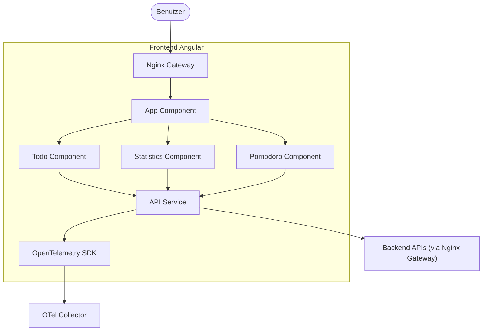
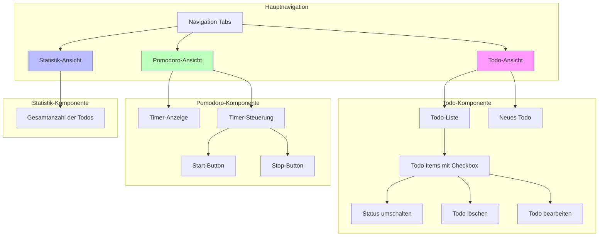
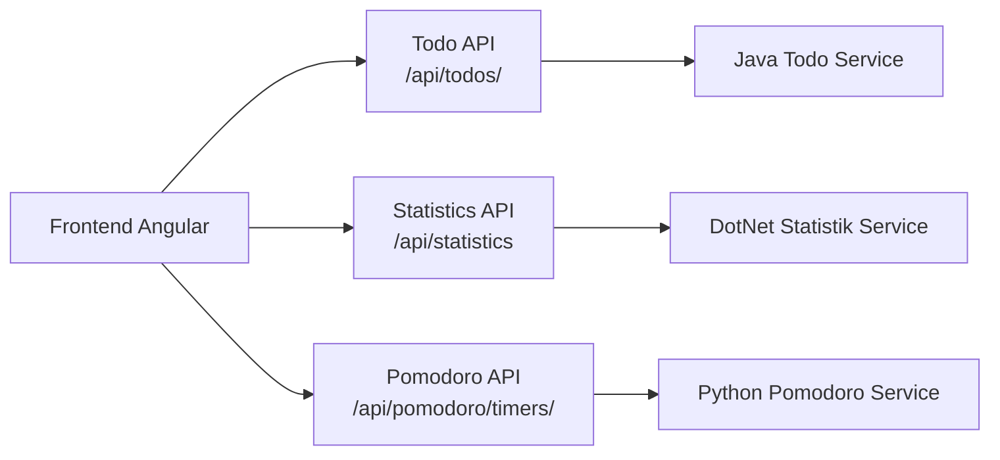
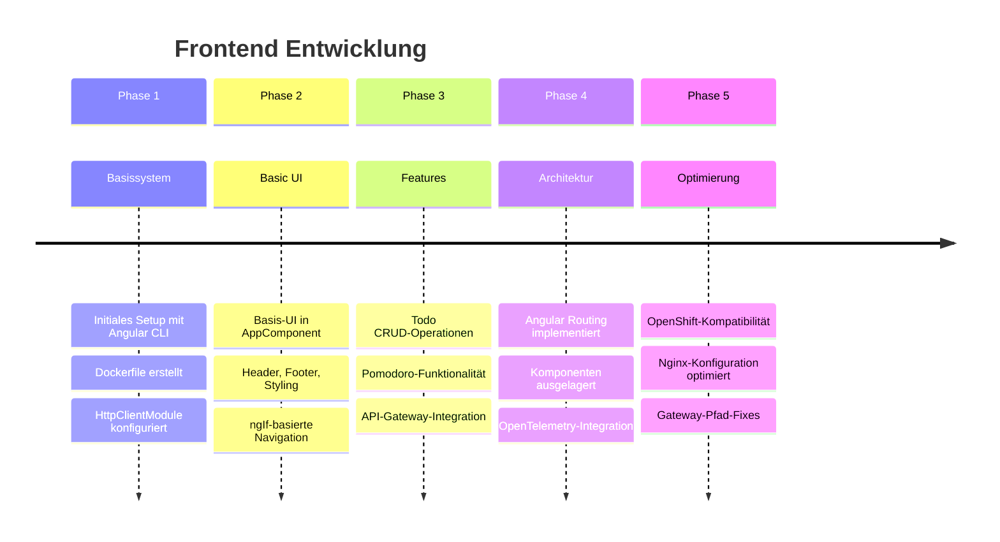
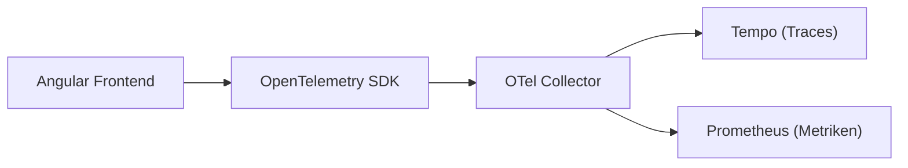

# Angular Frontend für SRE ToDo MVP

## Beschreibung

Dieses Frontend wurde mit Angular CLI erstellt und zeigt Daten aus den verschiedenen Backend-Microservices an.
Es ermöglicht Benutzern das Anzeigen, Erstellen und Verwalten von ToDos sowie die Steuerung eines Pomodoro-Timers.
Der Zugriff erfolgt über das Nginx Gateway (`http://localhost/`).

## Benutzeroberfläche

## API Endpunkte (Aufrufe durch das Frontend)

Das Frontend kommuniziert mit den Backend-Services über das Nginx Gateway unter folgenden Pfaden:

-   `GET /api/todos/`: Holt die Liste aller ToDos.
-   `POST /api/todos/`: Erstellt ein neues ToDo.
-   `PUT /api/todos/{id}`: Aktualisiert den Status eines ToDos.
-   `DELETE /api/todos/{id}`: Löscht ein ToDo.
-   `GET /api/statistics`: Holt die Statistik-Daten (akt. nur ToDo-Anzahl).
-   `GET /api/pomodoro/timers/{user_id}`: Holt den Status des Pomodoro-Timers.
-   `POST /api/pomodoro/timers/{user_id}/start`: Startet einen Pomodoro-Timer.
-   `POST /api/pomodoro/timers/{user_id}/stop`: Stoppt einen Pomodoro-Timer.

## UI Features

-   **Navigation:** Tabs/Links zum Wechseln zwischen ToDo-, Statistik- und Pomodoro-Ansicht.
-   **ToDo-Liste:** Anzeige der ToDos mit Checkbox für Status.
-   **ToDo Erstellen:** Formular zum Hinzufügen neuer ToDos.
-   **ToDo Löschen:** Button zum Löschen von ToDos (mit Bestätigung).
-   **ToDo Status:** Checkbox zum Umschalten des Erledigt-Status.
-   **Pomodoro:** Anzeige des Timer-Status, Buttons zum Starten (Work/Break) und Stoppen, Countdown-Anzeige.
-   **Statistik:** Anzeige der Gesamtanzahl der ToDos.

## Entwicklungsschritte

1.  Initiales Projekt-Setup mit `ng new`.
2.  Dockerfile erstellt (Multi-Stage mit Nginx).
3.  `HttpClientModule` konfiguriert.
4.  Basis-UI in `AppComponent` implementiert (API-Aufrufe für ToDos & Statistik).
5.  UI überarbeitet: Header, Footer, Styling, *ngIf-basierte Navigation.
6.  ToDo Erstellen, Löschen, Status-Toggle implementiert.
7.  Pomodoro-Ansicht und -Logik (inkl. Countdown) hinzugefügt.
8.  API-Aufrufe auf Nginx-Gateway-Pfade umgestellt (`/api/...`).
9.  Angular Routing implementiert (die Logik für die einzelnen Ansichten wurde in dedizierte Komponenten ausgelagert).
10. OpenTelemetry-Instrumentierung hinzugefügt, um Traces für Seitenaufrufe und HTTP-Anfragen zu generieren.
11. OpenShift-Kompatibilität durch Anpassungen im Dockerfile und Nginx-Konfiguration sichergestellt.
12. Nginx Gateway-Konfiguration für korrekte API-Pfadweiterleitung angepasst.

## Funktionalität

-   Zeigt eine Liste von ToDos an, die vom `service-java-todo` über das Nginx Gateway abgerufen werden.
-   Zeigt Statistiken (aktuell nur die Anzahl der ToDos) vom `service-dotnet-statistik` an.
-   Ermöglicht das Hinzufügen neuer ToDos.
-   Ermöglicht das Umschalten des Erledigt-Status von ToDos.
-   Ermöglicht das Löschen von ToDos.
-   Implementiert eine Pomodoro-Timer-Ansicht mit Start/Stop-Funktionalität und Countdown-Anzeige, gesteuert über `service-python-pomodoro`.
-   Ermöglicht das Bearbeiten des Textes bestehender ToDos.

## Implementierungsdetails

-   Verwendet Angular mit Standalone Components.
-   **Routing:** Nutzt das Angular Routing Modul (`provideRouter`, `app.routes.ts`, `RouterOutlet`, `RouterLink`, `RouterLinkActive`) um zwischen den Ansichten ToDo, Pomodoro und Statistik zu navigieren. Die Logik für die einzelnen Ansichten wurde in dedizierte Komponenten ausgelagert (`TodoComponent`, `PomodoroComponent`, `StatisticsComponent`).
-   **Styling:** Globale Styles (Layout, Header, Footer) sind in `src/styles.scss` definiert. Komponenten-spezifische Styles befinden sich in den jeweiligen `.scss`-Dateien der Komponenten.
-   Kommuniziert mit den Backend-Services über HTTP-Anfragen an das Nginx Gateway (`/api/...`) mittels eines zentralen `ApiService` (`api.service.ts`).
-   **Modelle:** Verwendet Interfaces (`Todo`, `PomodoroState`, `Statistics`) definiert in `models.ts`.
-   **OpenTelemetry:** Ist integriert, um Traces für Seitenaufrufe, Klicks und HTTP-Anfragen (Fetch/XHR) zu generieren. Die Konfiguration erfolgt in `src/app/tracing.ts` und wird in `src/main.ts` initialisiert.

## Observability

Das Frontend verwendet das OpenTelemetry SDK für Web, um Traces für Benutzerinteraktionen und API-Aufrufe zu generieren.

## OpenShift-Kompatibilität

Für die Bereitstellung in OpenShift wurden folgende Anpassungen vorgenommen:

-   **Port 8080:** Die Nginx-Konfiguration im Container wurde angepasst, um auf Port 8080 statt 80 zu lauschen, da OpenShift für non-root Container in der Regel Ports >1024 erfordert.
-   **Non-Root-Ausführung:** Das Dockerfile und die Nginx-Konfiguration wurden angepasst, um die Ausführung als non-root Benutzer zu ermöglichen.
-   **ConfigMap-Problem:** In der OpenShift-Deployment wurde eine statische HTML-Seite über eine ConfigMap eingebunden, die die Angular-Anwendung überdeckt. Diese muss entfernt werden, damit die korrekte Angular-Anwendung angezeigt wird.

## Starten (als Teil des Docker Compose Stacks)

Das Frontend wird als Teil des gesamten Stacks mit `docker-compose up` gebaut und gestartet. Es ist über das Nginx-Gateway auf `http://localhost/` erreichbar.

## Starten (in Kubernetes via Helm)

Das Frontend wird zusammen mit den anderen Services über Helm bereitgestellt (siehe `kubernetes/README.md`). Der Zugriff erfolgt ebenfalls über das Nginx Gateway, dessen Adresse vom Ingress-Controller abhängt (z.B. `http://localhost/` bei lokalem K8s oder die Route in OpenShift).

## Entwicklung

-   `cd frontend-angular`
-   `npm install` (falls noch nicht geschehen)
-   `ng serve`: Startet den Angular Development Server (typischerweise auf `http://localhost:4200`). Beachte, dass API-Aufrufe fehlschlagen können, wenn das Backend nicht läuft oder CORS nicht korrekt konfiguriert ist (im Docker-Setup wird dies durch Nginx gehandhabt).

## Nächste Schritte / TODOs

-   [ ] UI/UX-Verbesserungen.
-   [x] OpenTelemetry-Instrumentierung hinzufügen.
-   [x] Korrekte Implementierung von Angular Routing anstelle von `*ngIf` für die Ansichten.
-   [x] Auslagern der Interfaces in eigene Dateien (`models.ts`).
-   [ ] Verbesserung der Error-Handling-Logik (z.B. Anzeige von Fehlermeldungen bei fehlgeschlagenen API-Aufrufen).
-   [ ] Bessere visuelle Darstellung des aktuellen Pomodoro-Timer-Status.

## Bekannte Probleme

- In OpenShift zeigt das Frontend manchmal eine statische HTML-Seite anstelle der Angular-Anwendung, wenn die ConfigMap-Montage nicht entfernt wurde.
- Nach einem Neustart des Containers kann es kurzfristig zu CORS-Problemen kommen, bis das Nginx Gateway vollständig gestartet ist.

## Aktuelle Fixes (10.04.2025)

- Die Nginx-Gateway-Konfiguration wurde angepasst, um die 404-Fehler bei API-Anfragen zu beheben
- API-Pfade mit und ohne Schrägstrich am Ende werden jetzt korrekt an die Backend-Services weitergeleitet
