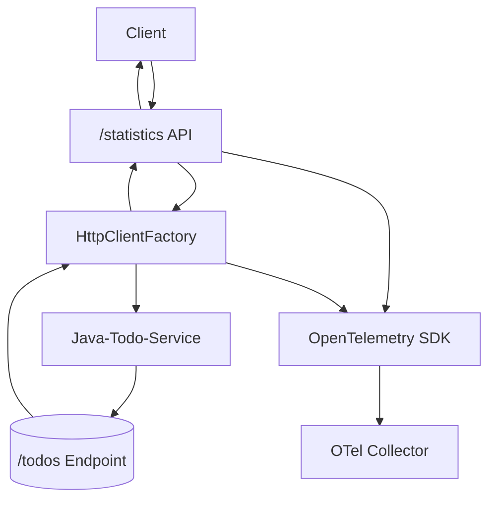
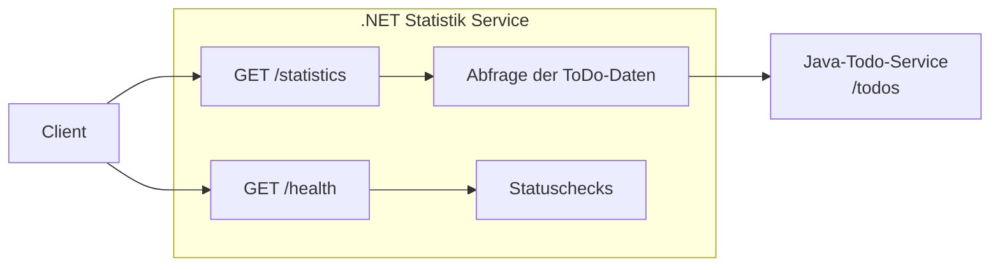
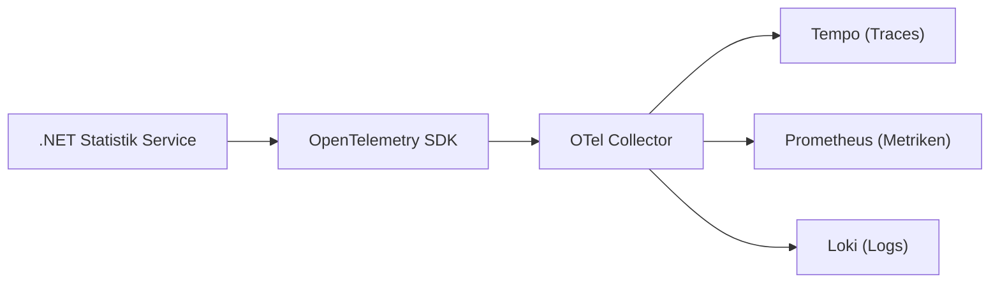

# Service .NET Statistik (ASP.NET Core)

## Beschreibung

Dieser Service aggregiert Daten von anderen Services (z.B. Anzahl erledigter ToDos) und stellt sie über eine REST API bereit.
Er ist mit ASP.NET Core 8 Minimal APIs implementiert und mit OpenTelemetry instrumentiert.

## API Endpunkte

| Endpunkt | Methode | Beschreibung | Response |
|----------|---------|--------------|----------|
| `/statistics` | GET | Ruft die Anzahl der ToDos vom `service-java-todo` ab | `{ "totalTodos": <int>, "error": <string \| null> }` |
| `/health` | GET | Gibt den Gesundheitsstatus des Services zurück | `{ "status": "UP" }` |

-   **`GET /health`**: Gibt den Service-Status zurück (`{"status": "UP"}`).
-   **`GET /statistics`**: Ruft die Anzahl der ToDos vom `service-java-todo` ab und gibt sie zurück.
    -   **Response Body:** `{ "totalTodos": <int>, "error": <string | null> }`
    -   Im Fehlerfall (z.B. ToDo-Service nicht erreichbar) wird `totalTodos` 0 sein und `error` eine Fehlermeldung enthalten.

## Service-Kommunikation

-   Der Service verwendet `IHttpClientFactory`, um Anfragen an andere Services zu senden.
-   Die Basis-URL für den `service-java-todo` ist auf `http://service-java-todo:8080/` konfiguriert.
-   In Kubernetes/OpenShift wird dieser Hostname über interne Service-Discovery aufgelöst.

## Entwicklungsschritte

*(Hier werden die Implementierungsschritte dokumentiert)*

1.  Initiales Projekt-Setup mit `dotnet new`.
2.  Dockerfile erstellt.
3.  `HttpClientFactory` konfiguriert.
4.  `/statistics`-Endpunkt implementiert, der `/todos` vom Java-Service aufruft.
5.  Einfachen `/health`-Endpunkt hinzugefügt.
6.  Explizites Lauschen auf `http://+:8080` in `Program.cs` konfiguriert.
7.  OpenTelemetry-Integration für Tracing hinzugefügt.
8.  Anpassung für die korrekte Kommunikation über das Nginx-Gateway.

## Observability

Der Service verwendet das OpenTelemetry SDK für .NET, um Traces zu generieren:

## Umgebungsvariablen

| Variable | Beschreibung | Standard |
|----------|--------------|----------|
| `ASPNETCORE_URLS` | URL, auf der der Service lauscht | `http://+:8080` |
| `OTEL_SERVICE_NAME` | Name des Services für Traces | `service-dotnet-statistik` |
| `OTEL_EXPORTER_OTLP_ENDPOINT` | Endpoint des OTel Collectors | `http://otel-collector:4318` |
| `TODO_SERVICE_HOST` | Hostname des ToDo-Services | `service-java-todo` |
| `TODO_SERVICE_PORT` | Port des ToDo-Services | `8080` |
| `TODO_SERVICE_URL` | Vollständige URL zum ToDo-Service | `http://service-java-todo:8080/todos` |