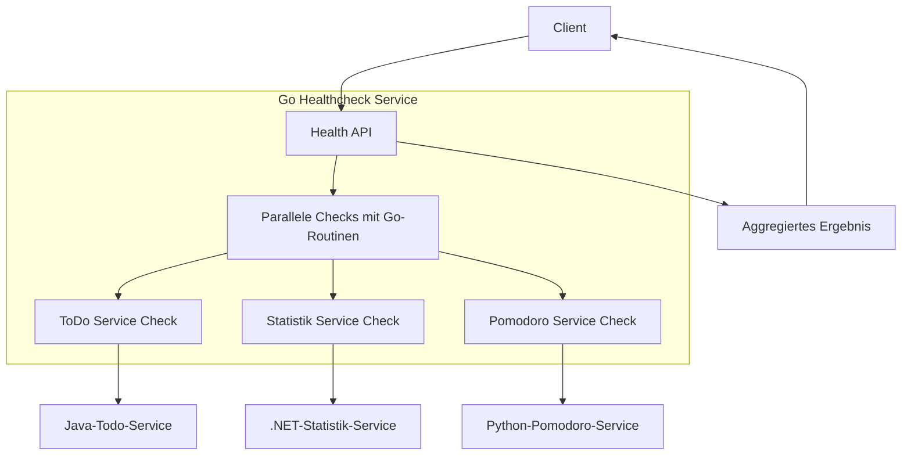
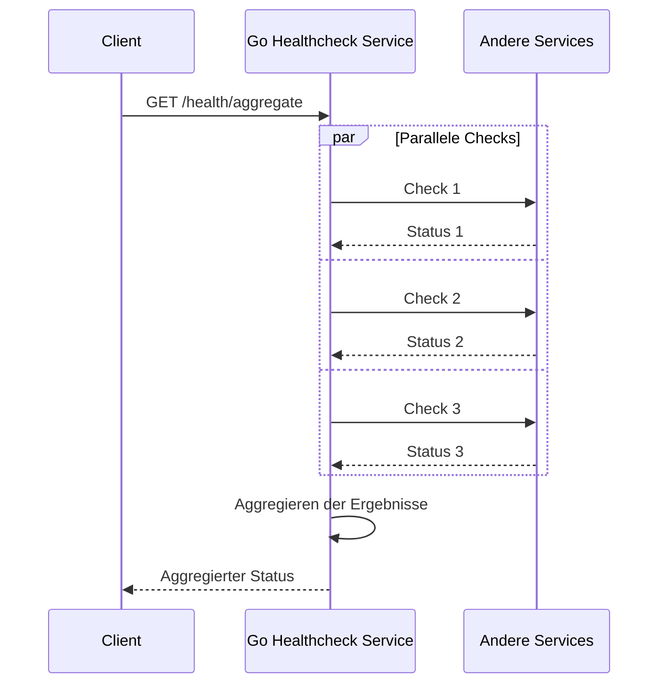
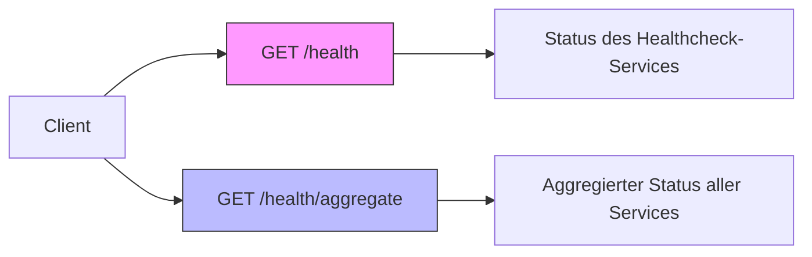
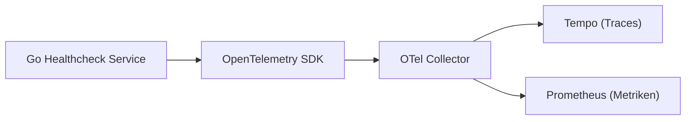

# Service Go Healthcheck

## Beschreibung

Dieser Service führt Health Checks für die anderen Microservices durch und stellt einen aggregierten Status über eine REST API bereit.
Er ist in Go implementiert und nutzt Go-Routinen für parallele Checks.

## Funktionsweise

1.  **Konfiguration:** Die URLs der zu prüfenden Services werden über Umgebungsvariablen (`CHECK_URL_TODO`, `CHECK_URL_POMODORO`, `CHECK_URL_STATISTIK`) aus der `docker-compose.yml` gelesen.
2.  **Prüfung:** Beim Aufruf des `/health/aggregate`-Endpunkts werden die konfigurierten URLs parallel via HTTP GET abgefragt.
3.  **Timeout:** Für jede Anfrage gibt es einen Timeout von 5 Sekunden.
4.  **Ergebnis:** Der Endpunkt gibt ein JSON-Objekt zurück, das den Gesamtstatus (`overallStatus`: "UP" oder "DEGRADED") sowie den individuellen Status ("UP", "DOWN", "UNKNOWN") jedes geprüften Services enthält.

## API Endpunkte

| Endpunkt | Methode | Beschreibung | Response | Status Codes |
|----------|---------|--------------|----------|--------------|
| `/health` | GET | Status des Healthcheck-Services | `{"status": "UP"}` | 200 |
| `/health/aggregate` | GET | Aggregierter Status aller Services | Siehe unten | 200, 503 |

-   **`GET /health`**: Gibt den Status des Healthcheck-Services selbst zurück (`{"status": "UP"}`).
-   **`GET /health/aggregate`**: Führt die parallelen Checks aus und gibt den aggregierten Status aller konfigurierten Services zurück.
    -   **Response Body:** `{ "overallStatus": "<string>", "durationMs": <int>, "services": { "<serviceName>": { "service": "<serviceName>", "status": "<string>", "error": "<string | null>" }, ... } }`
    -   **Status Codes:** `200 OK` (wenn `overallStatus` "UP"), `503 Service Unavailable` (wenn `overallStatus` "DEGRADED").

## Entwicklungsschritte

*(Hier werden die Implementierungsschritte dokumentiert)*

1.  Initiales Projekt-Setup mit `go mod init`.
2.  Dockerfile erstellt (Multi-Stage).
3.  Einfachen `/health`-Endpunkt implementiert.
4.  Logik zum Lesen von Ziel-URLs aus Umgebungsvariablen hinzugefügt.
5.  Funktion `checkService` zur Prüfung einer einzelnen URL implementiert.
6.  Endpunkt `/health/aggregate` hinzugefügt, der `checkService` parallel aufruft und Ergebnisse aggregiert.
7.  Einbindung in das Gesamtsystem über Docker Compose und Kubernetes konfiguriert.

## Observability

Der Service verwendet das OpenTelemetry SDK für Go, um Traces und Metriken zu generieren. Die Logs werden über Standard-Output erzeugt.

## Umgebungsvariablen

| Variable | Beschreibung | Standard |
|----------|--------------|----------|
| `PORT` | Port, auf dem der Service lauscht | `8003` |
| `CHECK_URL_TODO` | URL für den Health-Check des Todo-Services | `http://service-java-todo:8080/actuator/health` |
| `CHECK_URL_STATISTIK` | URL für den Health-Check des Statistik-Services | `http://service-dotnet-statistik:8080/health` |
| `CHECK_URL_POMODORO` | URL für den Health-Check des Pomodoro-Services | `http://service-python-pomodoro:8002/health` |
| `OTEL_SERVICE_NAME` | Name des Services für Traces | `service-go-healthcheck` |
| `OTEL_EXPORTER_OTLP_ENDPOINT` | Endpoint des OTel Collectors | `http://otel-collector:4318` |