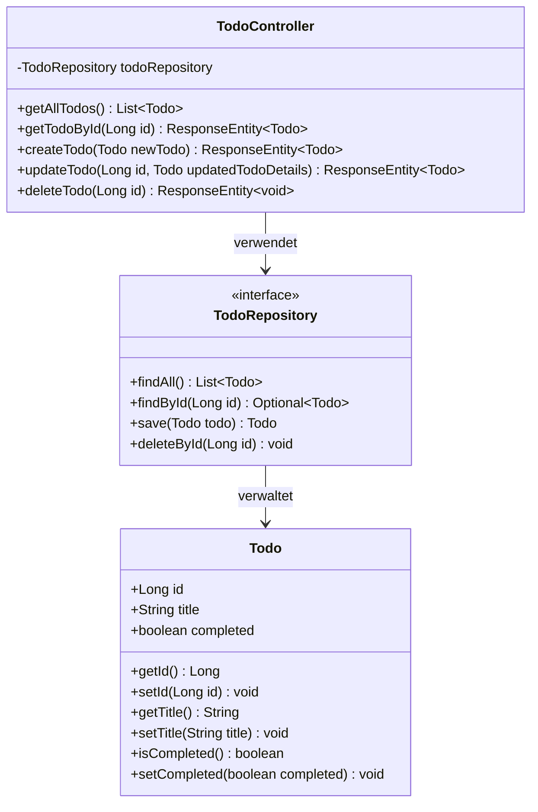
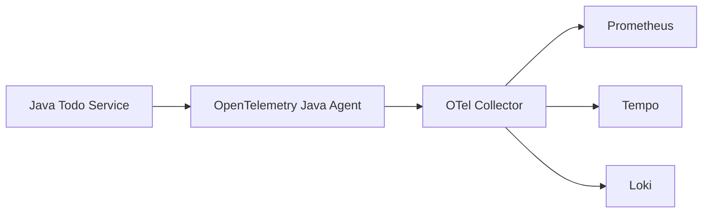

# Service Java ToDo (Spring Boot)

## Beschreibung

Dieser Service verwaltet die ToDo-Items über eine REST API. Er ist in Java mit Spring Boot implementiert und verwendet eine PostgreSQL-Datenbank zur Persistierung der Daten. Der Service ist mit OpenTelemetry instrumentiert, um Metriken, Traces und Logs zu sammeln.



## API-Endpunkte

```mermaid
graph LR
    A[Client] --> B[GET /todos]
    A --> C[GET /todos/{id}]
    A --> D[POST /todos]
    A --> E[PUT /todos/{id}]
    A --> F[DELETE /todos/{id}]
    
    B --> G[TodoController]
    C --> G
    D --> G
    E --> G
    F --> G
    
    G --> H[TodoRepository]
    H --> I[(PostgreSQL)]
```

| Methode | Pfad         | Beschreibung                           | Request Body     | Response                     |
|---------|--------------|----------------------------------------|------------------|------------------------------|
| GET     | /todos       | Alle ToDos abrufen                     | -                | Array von Todo-Objekten      |
| GET     | /todos/{id}  | Ein spezifisches ToDo abrufen          | -                | Todo-Objekt oder 404         |
| POST    | /todos       | Ein neues ToDo erstellen               | Todo-Objekt      | Erstelltes Todo mit Status 201|
| PUT     | /todos/{id}  | Ein bestehendes ToDo aktualisieren     | Todo-Objekt      | Aktualisiertes Todo oder 404 |
| DELETE  | /todos/{id}  | Ein bestehendes ToDo löschen           | -                | 204 No Content oder 404      |

## Entwicklungsschritte

*(Hier werden die Implementierungsschritte dokumentiert)*

1.  Initiales Projekt-Setup mit Maven.
2.  Dockerfile erstellt.
3.  Grundlegende CRUD-Endpunkte mit In-Memory-Speicher implementiert.
4.  PostgreSQL-Datenbank zum Docker Compose Stack hinzugefügt.
5.  Abhängigkeiten für Spring Data JPA und PostgreSQL-Treiber hinzugefügt (`pom.xml`).
6.  `application.properties` für DB-Verbindung konfiguriert.
7.  `Todo`-Klasse zu JPA-Entität umgewandelt.
8.  `TodoRepository` (Spring Data JPA) erstellt.
9.  Controller zur Verwendung des Repositories und der DB statt In-Memory-Speicher angepasst.
10. Testdaten über `@PostConstruct` im Controller initialisiert.
11. OpenTelemetry Java Agent zum Dockerfile hinzugefügt und im `ENTRYPOINT` aktiviert.
12. OTel Agent via Umgebungsvariablen in `docker-compose.yml` konfiguriert (Service Name, Collector Endpoint, Exporter-Einstellungen).
13. Logback-Appender-Instrumentierung für OTLP-Logs aktiviert (`otel.instrumentation.logback-appender.enabled=true`).
14. Nginx-Gateway-Integration für korrekte Pfadweiterleitung implementiert.

## Observability

Der Service ist mit OpenTelemetry instrumentiert und sendet Telemetriedaten an den OpenTelemetry Collector:



- **Metriken**: JVM-Metriken und Spring-spezifische Metriken werden automatisch gesammelt
- **Traces**: HTTP-Anfragen und Datenbankoperationen werden automatisch instrumentiert
- **Logs**: Logback-Appender für OTLP-Logs aktiviert zur Korrelation von Logs und Traces

## Umgebungsvariablen

| Variable                         | Beschreibung                               | Standard-Wert                         |
|----------------------------------|--------------------------------------------|-----------------------------------------|
| SERVER_PORT                      | Port, auf dem der Service läuft            | 8080                                    |
| SPRING_DATASOURCE_URL            | PostgreSQL-Verbindungs-URL                 | jdbc:postgresql://postgresql:5432/sretodo_db |
| SPRING_DATASOURCE_USERNAME       | PostgreSQL-Benutzername                    | sretodo_user                            |
| SPRING_DATASOURCE_PASSWORD       | PostgreSQL-Passwort                        | sretodo_password                        |
| OTEL_SERVICE_NAME                | Name des Services für Telemetrie           | service-java-todo                       |
| OTEL_EXPORTER_OTLP_ENDPOINT      | Endpunkt des OTel Collectors               | http://otel-collector:4318              |