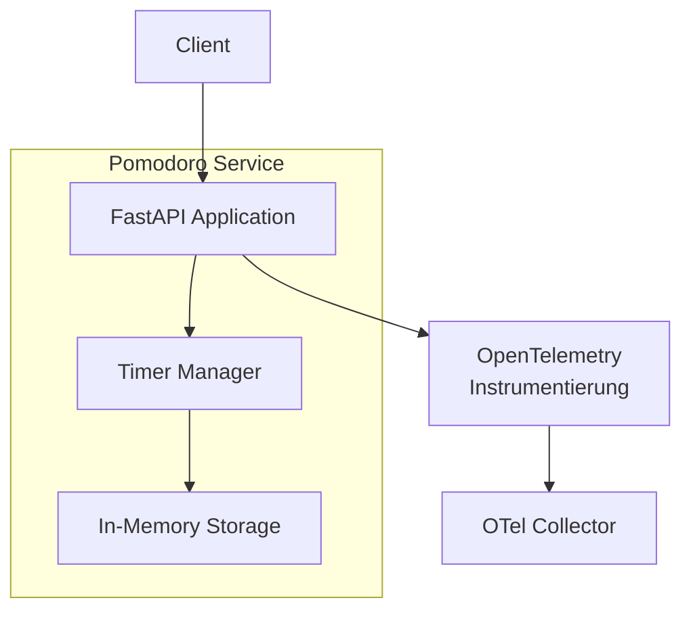
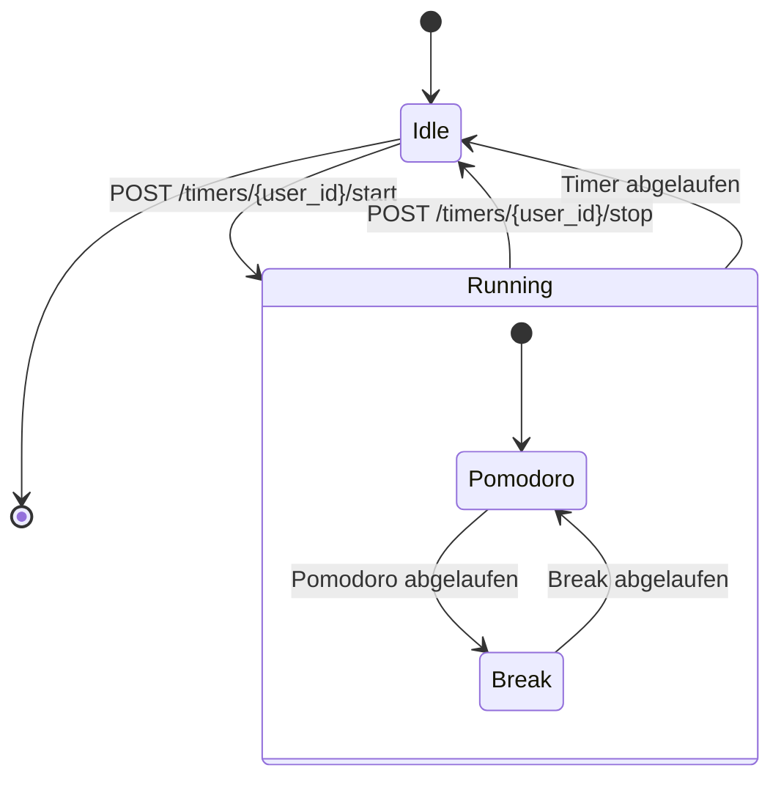
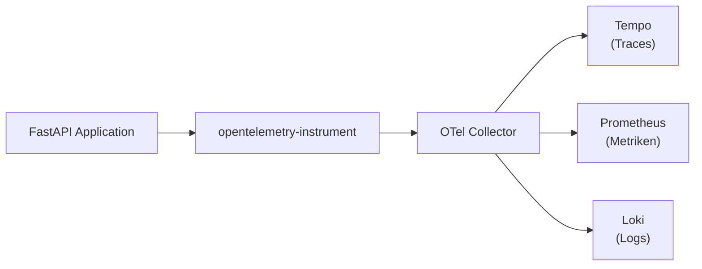
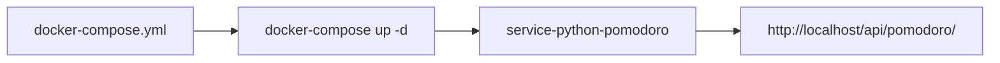

# Service: Python Pomodoro (FastAPI)

Dieser Service implementiert eine einfache Pomodoro-Timer-API mit FastAPI. Er ermöglicht das Starten, Stoppen und Abfragen von Pomodoro-Timern für verschiedene Benutzer.



## Funktionsweise



## Endpunkte

```mermaid
graph LR
    A[Client] --> B[GET /health]
    A --> C[POST /timers/{user_id}/start]
    A --> D[POST /timers/{user_id}/stop]
    A --> E[GET /timers/{user_id}]
    
    style B fill:#f9f,stroke:#333
    style C fill:#bbf,stroke:#333
    style D fill:#bbf,stroke:#333
    style E fill:#bfb,stroke:#333
```

| Endpunkt | Methode | Beschreibung | Request Body | Response |
|----------|---------|--------------|--------------|----------|
| `/health` | GET | Statusprüfung | - | `{"status": "UP"}` |
| `/timers/{user_id}/start` | POST | Startet einen Timer | `{"duration": <seconds>}` (optional) | `{"status": "started", "end_time": <timestamp>}` |
| `/timers/{user_id}/stop` | POST | Stoppt einen Timer | - | `{"status": "stopped"}` |
| `/timers/{user_id}` | GET | Gibt den Status zurück | - | `{"status": "running", "remaining": <seconds>}` oder `{"status": "idle"}` |

## Technologie

- Python 3.12
- FastAPI
- Uvicorn

## Observability

Die Instrumentierung für OpenTelemetry (Traces, Logs, Metriken) erfolgt **automatisch** über den `opentelemetry-instrument` Agenten.



- **Abhängigkeiten:** `opentelemetry-distro` und `opentelemetry-exporter-otlp` sind in `requirements.txt` definiert.
- **Installation der Instrumentierung:** Der `opentelemetry-bootstrap -a install` Befehl im `Dockerfile` installiert automatisch die notwendigen Instrumentierungsbibliotheken (z.B. für FastAPI, Logging).
- **Start:** Der Container wird über `CMD ["opentelemetry-instrument", "uvicorn", ...]` im `Dockerfile` gestartet.
- **Konfiguration:** Der Agent wird über Umgebungsvariablen in `docker-compose.yml` konfiguriert (z.B. `OTEL_SERVICE_NAME`, `OTEL_EXPORTER_OTLP_ENDPOINT`, `OTEL_TRACES_EXPORTER`, `OTEL_METRICS_EXPORTER`, `OTEL_LOGS_EXPORTER`, `OTEL_EXPORTER_OTLP_PROTOCOL`).

Es ist **kein manueller** OpenTelemetry-Initialisierungscode in `app.py` mehr notwendig.

## Umgebungsvariablen

| Variable | Beschreibung | Standard |
|----------|--------------|----------|
| `PORT` | Port, auf dem der Service läuft | `8002` |
| `OTEL_SERVICE_NAME` | Name des Services für Telemetrie | `service-python-pomodoro` |
| `OTEL_EXPORTER_OTLP_ENDPOINT` | Endpunkt des OTel Collectors | `http://otel-collector:4318` |
| `OTEL_TRACES_EXPORTER` | Exporter für Traces | `otlp` |
| `OTEL_METRICS_EXPORTER` | Exporter für Metriken | `otlp` |
| `OTEL_LOGS_EXPORTER` | Exporter für Logs | `otlp` |

## Starten (innerhalb von Docker Compose)



Der Service wird automatisch als Teil des `docker-compose up` Befehls im Hauptverzeichnis gestartet.

## Starten (in Kubernetes via Helm)

Der Service wird zusammen mit den anderen Services über Helm bereitgestellt (siehe `kubernetes/README.md`). Die Konfiguration der OTel-Umgebungsvariablen erfolgt ebenfalls über die Helm-Charts.